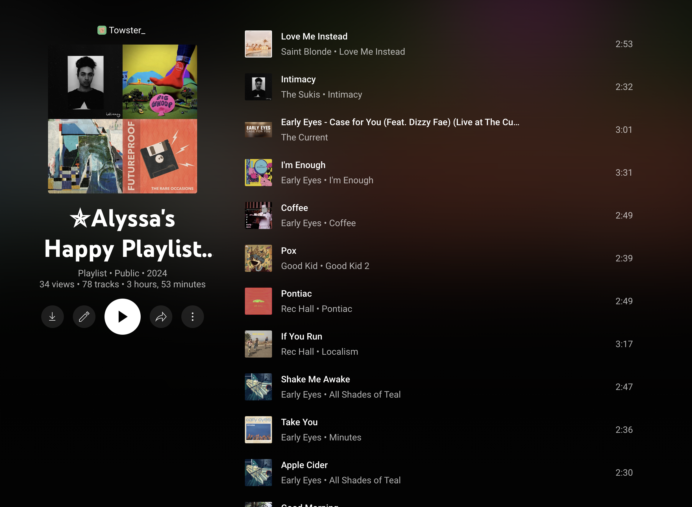

# Spotify to Youtube

Something to tranfer playlist from spotify to youtube. 
A problem with this is that there is a limit on how many things you can do with youtube at once so, you have to run this multiple times so you have all the youtube songs

# How to use this project

- Please have python installed
- Then install pip3
- Using pip, install the googleapi, spotipy, sys and json
- then create a google api account.
- Finally, put your credentials in all three files where there will be variables with `<INSERT HERE>` that you will have to replace.

## How to get into the developer's console

1. Log in to Google Developers Console.
2. Create a new project.
3. On the new project dashboard, click Explore & Enable APIs.
4. In the library, navigate to YouTube Data API v3 under YouTube APIs.
5. Enable the API.
6. Create a credential.
7. A screen will appear with the API key.
